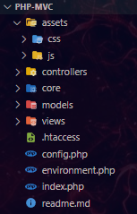

# 📂 PHV MVC

## 📃 Estrutura MVC para projetos PHP

> Frontend - Apresentação da proposta visual

## 🚀 Tecnologias

- HTML
- CSS
- JavaScript
- PHP
- MVC
- Composer
- Git e Github

## 📝 Comandos

    composer install

---
---

## 📧 Contato

[LinkedIn](https://www.linkedin.com/in/wsawebmaster/)

[wsawebmaster@yahoo.com.br](mailto:wsawebmaster@yahoo.com.br)
